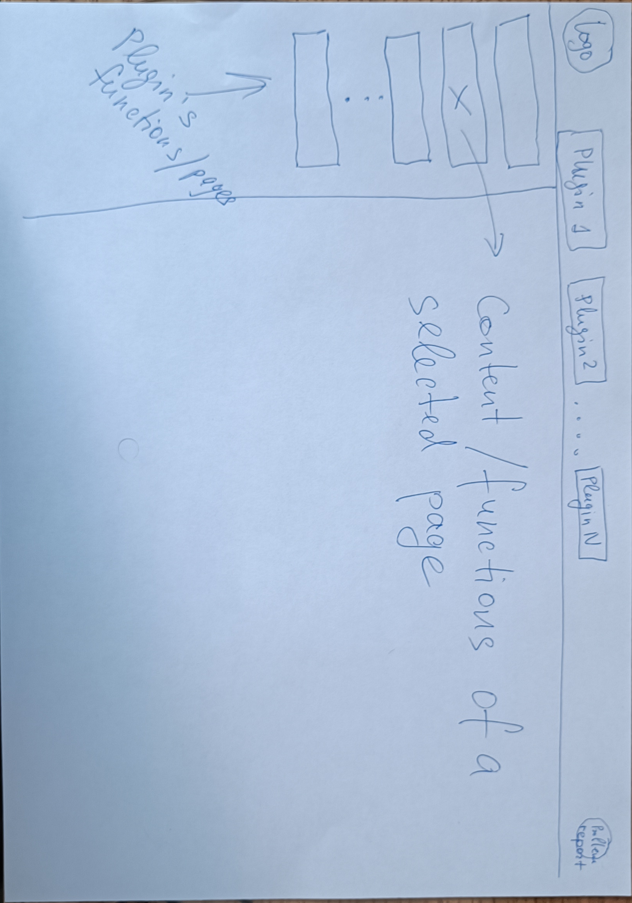

# The Locveil Workbench and the UI deploy-split (PROD-24)

**Status:** decided design. Codifies the PROD-24 shell council (2026-07-14, two rounds,
all three keepers, seeded by the owner's wireframe sketch). The decision record is the
**PROD-24 entry in `board/BOARD.md`** (landed @ `fee05cc`); this document is its
normative elaboration — on disagreement the board entry wins, then this doc, never the
(ephemeral) council dossier. Design only: implementation is gated per §9.

Consumers: PROD-10 ④ (ui-kit component boundaries), the product repos' plugin intake
tasks (bridge UI-17 lineage, voice sprint-02 adoption), satellite DES-5 (expanded).

---

## 1. The UI classes

Every Locveil UI surface belongs to exactly one class:

- **operations** — controller-deployed (served from the WB7), always-on, family-facing.
  Optimized for the room: live state, SSE, iPad-on-the-wall.
- **workbench** — workstation-deployed: the **Locveil Workbench**, ONE shell application
  the operator runs on demand; repos plug in panels contributing content and
  functionality. Setup, configuration, provisioning, diagnostics.
- **public site** — `locveil.com` (PROD-9). Not a shell concern; out of Workbench v1.
- **neither / on-device** — UIs served by a device itself (satellite softAP portal +
  Stage-2 admin UI, D-16). Classified for completeness; the split does not move them.

## 2. The classification (council decision 2)

| surface | class | notes |
|---|---|---|
| voice config-ui | **workbench** | Voice's operations column is empty by design (the controller runs the headless backend only). Becomes the **Voice plugin**: **6 pages** — the Overview page and config-ui's own top bar retire into shell chrome + Monitoring; the contract's status slot (§4) preserves connection/health visibility. |
| bridge `ui/` + appliance/room pages | **operations** | Stays controller-served as-is. The unbuilt "admin route / auth shell" scope all four planned pages declared is **deleted from operations** — the Workbench answers it once. |
| bridge device-setup, topology-setup, voice-setup | **workbench** | One **Bridge plugin** tab; IR learning is a sidebar entry under device-setup; voice-setup stays under Bridge (it is a bridge-backend surface despite the name). |
| satellite on-device softAP / admin UI | neither | D-16; lives on the device. |
| satellite cert operations (write path) | **privileged broker** | See §6. Owner ruling: the CLI's functionality MUST be replicated in the UI; CLI and page become peer clients of ONE privileged code path. The CA-key privilege boundary survives; the SSH-only gate does not. D-17 second amendment lands via the expanded DES-5. |
| satellite fleet / provisioning / config page | **workbench (dormant)** | Registry-declared, not rendered until gated in (§4, §6). Future scope: ESP32 satellites provisioned AND configured (rooms + wake model) through this page. |
| voice desktop-satellite config page | **workbench (voice-owned)** | Under the Voice tab. Edits the same CoreConfig `[satellite]` / `[vad]` / `[voice_trigger]` sections config-ui already knows; write path = satellite-local endpoint (§5, dev-phase). |
| PROD-9 landing page | public site | Out of shell v1. |

## 3. The shell



The wireframe is ratified **as drawn**: top bar = logo · one tab per plugin · problem-
report button top-right; left sidebar = the active plugin's pages/functions; main area =
the selected page.

- **Granularity: repo = plugin.** One tab per product (Voice, Bridge, later Satellite).
  Per-device or per-feature drill-down is *pages*, never tabs — the tab bar must not
  churn with runtime data.
- **Chrome owns:** the logo, plugin tabs (+ per-plugin status badge), the locale switch
  (RU/EN), the problem-report button (§8), and a **reserved auth-guard slot** (§7),
  empty in v1.
- **Stack:** React 18 SPA. Home: commons **`packages/workbench`**, versioned
  independently as `workbench-vX` (regime 2: commons owns the shell; products pin).
  Built ON ui-kit tokens/components (PROD-10) — the shell has no MUI or Tailwind
  dependency of its own.
- **Toolchain** (sprint-01 decision 1 as clarified by the council): eslint-9 flat config
  is the shared target; **vite majors are per-consumer** (bridge on 6, voice on 8);
  ui-kit and the workbench publish version-agnostic ESM + types.

## 4. The plug-in contract v1 (council decision 4)

Shape sketch (the implementation task refines names, not semantics):

```ts
interface WorkbenchPlugin {
  id: "voice" | "bridge" | "satellite" | string;
  title: LocalizedString;
  pages: () => PageDescriptor[];      // RUNTIME-registrable — lazy/computed is legal
                                      // (voice UI-16 schema-driven pages must fit)
  i18n?: I18nBundles;                 // plugin ships its own RU/EN bundles;
                                      // the shell provides the active locale
  status?: () => PluginStatus;        // the status slot: tab badge / sidebar header
                                      // (absorbs config-ui's Header health info)
  reportHook?: (ctx: ReportContext) => void;   // §8; optional
  gate?: GateDescriptor;              // dormant plugins: declared, NOT rendered
}

interface PageDescriptor {
  route: string;
  title: LocalizedString;
  backendTarget: BackendTargetRef;    // PER-PAGE, heterogeneous classes allowed:
                                      // dev backend vs WB7 (voice), controller API
                                      // (bridge), device-local endpoint (satellite)
  verbs?: DormantVerb[];              // verbs with NAMED GATES (§6) render disabled
                                      // with their gate, never hidden dishonestly
  render: LazyComponent;
}
```

**Rules:**

- Plugin **source lives in its owning repo** — openapi type generators stay repo-side
  (`cross-repo-source-of-truth`); the shell never carries a hand-copied schema and never
  imports a product repo's TS sources. **Explicit exception (HK-11, satellite-requested
  record): the satellite panel's frontend code lives commons-side** — no frontend
  toolchain ever enters the ESP-IDF/KiCad repo; satellite contributes only its versioned
  data surfaces (`esp32-site`, the DES-5 broker) and its DONE entries discharge the gate.
- **Consumption = RUNTIME ASSEMBLY (amended by council HK-11, 2026-07-15; supersedes the
  build-time `file:` mechanism).** Mechanism: **native ESM dynamic import + import
  map** — browser-native, bundler-agnostic (build tools are deliberately NOT harmonized
  across repos; what must match is the runtime peer set, enforced below — the owner's
  harmonization question, answered on record at HK-11).
  - The shell serves an **import map** with exactly the singleton set: `react`,
    `react-dom(/client)`, `react/jsx-runtime`, `react-router-dom` (**pinned major 6**),
    `locveil-ui-kit`. Everything else (react-query, zustand, axios, i18next…) bundles
    into each plugin; i18n is plugin-local instances + the shell's locale signal.
  - Each plugin's dist carries a **build-emitted manifest fragment**
    `{id, version, entry, styles[], peers{}, backendCompat?}` — generated by the owning
    repo, never hand-written into commons. The shell's config (owner-edited,
    workstation) lists **locations only** — dev-phase: sibling `dist/` paths — plus
    **dormant slots** (`{id, title, gate}` with NO location: the shell performs zero
    fetch/import/probe for them; gates support conjunctions, e.g. DES-5 AND first
    light).
  - **Peer mismatch = strict refuse-and-surface** (owner ruling): a plugin whose
    `peers` disagree with the shell's singletons on a major does not load, and the
    shell names the disagreement — never warn-and-load.
  - The shell owns style inject/remove from the fragment's `styles`; the shell loads
    tokens.css + one Tailwind preflight; plugin builds disable preflight.
  - Dev loop: `vite build --watch` + browser reload against a running shell; no
    cross-bundle HMR is part of the contract. No serving pipelines anywhere in v1;
    published-artifact URLs are the productization step, and pinning them (if ever) is
    a deliberate contracts-convention act (new tag family).
  - The fragment schema is a commons-owned contract surface, versioned with
    **`workbench-vX`**.
- **Dormant registration:** a gated plugin/verb is registry-declared with its gate
  reference (satellite: DES-5 + first light) and not rendered until the gate is
  discharged — rendered dormant with its gate named, never "failed to load".
- Plugins may not require chrome changes; anything a plugin needs from the shell goes
  through this contract, and contract changes go through commons (a ledger task +
  `workbench-vX` bump).

## 5. Config-target ownership and the write model — DEV-PHASE

> **Owner ruling (council round 2, recorded verbatim in intent):** this model is fine
> for the dev phase while the owner is the only user and customer. **The final
> design/convention is deferred to a further productization step.** The convention's
> normative home is **PROD-4 item (4)** (amended by this council); this section is the
> Workbench-side rendering of it.

Every config target a workbench page touches is classified by **ownership**:

- **repo-owned** (bridge config tree, voice WB7 TOML): pages write **staged proposals**
  via controller APIs (bridge: `data/staged-config/` inside the already-writable data
  mount) — never the live tree. Promotion to canon is an **explicit human commit** to
  the repo; live mounts stay read-only; `update.sh` one-way sync is unchanged. "Apply"
  in a page stages; it never mutates running config.
- **device-owned** (desktop satellite today; ESP32 satellites later): no repo master
  exists — direct write via a device-local endpoint is honest. The desktop-satellite
  config page (voice-owned) reads/writes through a minimal authenticated satellite-local
  config endpoint (new voice design task; dev-phase shape, same deferral).
- **privileged** (cert operations): only via the satellite broker (§6). Never direct.

**Binding condition (bridge, on record): no write API ships before PROD-4's auth
decision lands.** Design may proceed; endpoints may not.

## 6. Satellite: the broker and the reserved verbs

One privileged code path, two clients: a featherweight controller-side broker (key-owning
user, localhost/unix-socket, authenticated zone) exposes narrow verbs; the existing
`esp32-provision` CLI becomes a peer client of the same path — never a second signing
implementation. This is the D-17 **second amendment**, designed inside the expanded
DES-5 (delegated at council close), which also owns the **workstation operator
credential** question (client cert from the home CA vs a separate secret) and carries
the OPS earmark for the ansible-deploy rework.

| verb | gate |
|---|---|
| `list` / `status` (pending CSRs, issued counts, fleet) | broker v1 + a read surface (`esp32-site` version bump) |
| `approve` / `reject-pending` | broker v1 (post-DES-5 design) |
| `revoke-issued` / `renew` | DES-5 verb vocabulary |
| remote room / wake-model reconfiguration of a live device | device-side FW capability (first light) + §5 write model |

Honesty requirements: re-provisioning leaves the old cert trusted for its full term
until DES-5 lands — the page renders that truthfully, never a fake "revoked". The
**desktop satellite** (voice's `locveil-voice-satellite`, same CSR flow against the same
Plane-B endpoints) is the page's first test target — testable only once the broker/read
surface exists.

## 7. Auth posture (v1)

Fact on record: both product backends currently serve `allow_origins=["*"]` with no REST
auth — LAN-trust. Workbench v1 **documents** that assumption; it does not change it.
The chrome reserves an auth-guard slot so PROD-4's decision drops in without redesign.
The posture decision itself — and the timing of the first write API — is **PROD-4's**
(see §5 binding condition). The satellite broker's authentication is DES-5's (§6).

## 8. Problem-report

The chrome button stays (owner): Material `BugReport` glyph in bridge-ui's
quiet-grey/amber-hover treatment; the SVG ships in ui-kit — no MUI dependency. The
**pipeline is deferred out of v1** (owner, council round 1): when a plugin provides
`reportHook`, the button delegates to it (bridge: its live pin-validated
`POST /reports`); the shell-level fallback (dormant plugins, shell-own bugs, the
satellite case — headless devices whose only intake is a human at the shell) is designed
later under **PROD-19**, carrying active plugin/page context in the payload.

## 9. Sequencing and non-goals

- **First two plugins:** voice config-ui (sprint-02 adoption task: 6-page cut +
  status-slot wiring) and the bridge setup pages (per bridge UI-17's design).
  **No plugin framework before both exist** (PROD-10 rule) — until then the "registry"
  may be a hand-maintained list in the shell.
- Gated behind PROD-4: any write API; the auth guard. Behind DES-5: broker, cert verbs,
  operator credential. Behind first light: satellite remote config, fleet reality.
- **Non-goals of v1:** the final write/distribution conventions (productization step);
  the shell-level reporter fallback (PROD-19); `revoke`/`renew` (DES-5); the
  "where is a page-initiated room change written first" question (voice registry vs
  bridge catalog vs NVS — flagged to the DES-4/PROD-20 lane); landing-page integration
  (PROD-9).

## 10. Change control

Commons owns the shell, the contract, and this document; changes happen through commons
ledger tasks and `workbench-vX` bumps — no product repo reshapes the nav model or the
contract unilaterally. Products own their plugins' content, pages, and backends
entirely. A chrome bug files in commons; a panel bug files in its product repo.

References: `board/BOARD.md` PROD-24 (decision record) · `board/sprints/sprint-01.md` ·
`docs/design/ui/workbench-wireframe.png` (the ratified sketch) · PROD-4 item (4) (write
convention + auth) · PROD-10 (ui-kit/stylebook) · PROD-19 (reporter fallback) ·
satellite DES-5 as expanded (broker) · bridge `docs/planned/*` (page-level designs).
