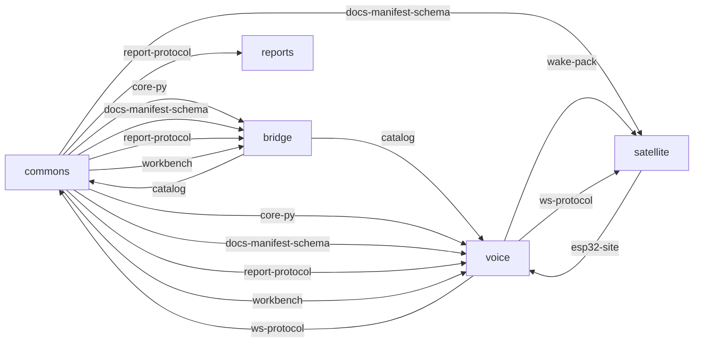

# The Locveil contract graph — GENERATED VIEW

> **Generated by `packages/contract-graph/contract_graph.py` — never edit, never
> cite as a source.** The sources are each owner's `contracts/<name>/STAMP.json`
> and each consumer's `.repin.toml` + `PIN.json` (HK-13). Regenerate after a cut
> or a re-pin; `--check` tells you when this page is stale. It shows declared
> edges only — a surface consumed with no pin is invisible here by definition.

## Who consumes what

## Owned surfaces

| Owner | Contract | Tag | Enumerated artifacts | Guard |
|---|---|---|---|---|
| commons | `contract-guard` | `contract-guard-v4.0.0` | `packages/contract-guard/contract_guard.py` | `packages/contract-guard/tests/test_contract_guard.py` |
| commons | `core-py` | `core-py-v1.1` | `packages/core-py/entry_point_loader.py` | — |
| commons | `docs-manifest-schema` | `docs-manifest-schema-v1.0.0` | `process/user-docs/manifest.schema.json` | `eval/tests/test_docs_manifest.py` |
| commons | `repin` | `repin-v2.0.0` | `packages/repin/repin.py` | `packages/repin/tests/test_repin.py` |
| commons | `report-protocol` | `report-protocol-v1.0.1` | `contracts/report-protocol/report-protocol.json` | — |
| commons | `scope` | `scope-v7.3.1` | `packages/scope-guard/scope_guard.py` | — |
| commons | `ui-kit` | `ui-kit-v1.3.0` | _none (empty by declaration)_ | `eval/tests/test_ui_kit_tokens.py` |
| commons | `workbench` | `workbench-v1.3.0` | `packages/workbench/src/contract.ts` `packages/workbench/schemas/manifest-fragment.schema.json` `packages/workbench/schemas/runtime-config.schema.json` | `eval/tests/test_workbench_schemas.py` |
| voice | `trace-format` | `trace-format-v1.0.1` | `docs/guides/tracing.md` | — |
| voice | `ui-openapi` | `ui-openapi-v1.2.0` | _none (empty by declaration)_ | `backend/tests/test_openapi_drift.py` |
| voice | `wake-pack` | `wake-pack-v1.0.1` | _none (empty by declaration)_ | `backend/tests/test_ws_protocol_version.py::test_wake_pack_stamp_mirrors_released_catalog` |
| voice | `ws-protocol` | `ws-protocol-v1.2.0` | `docs/guides/websocket-api.md` `contracts/ws-protocol/frames.golden.json` `contracts/ws-protocol/transcript.audio-batch.jsonl` `contracts/ws-protocol/transcript.audio-streaming.jsonl` `contracts/ws-protocol/transcript.audio-trace.jsonl` `contracts/ws-protocol/transcript.audio-rejected.jsonl` `contracts/ws-protocol/transcript.reply-burst.jsonl` `contracts/ws-protocol/transcript.satellite-pair.jsonl` `contracts/ws-protocol/transcript.reconnect.jsonl` `contracts/ws-protocol/transcript.output-push.jsonl` `contracts/ws-protocol/transcript.observe-tap.jsonl` `contracts/ws-protocol/ws-protocol.schema.json` | `backend/tests/test_ws_machine_core.py` |
| bridge | `catalog` | `catalog-v1.11.0` | `contracts/catalog/catalog.golden.json` `contracts/catalog/openapi.json` `contracts/catalog/catalog-contract.md` | — |
| bridge | `device-integration` | `device-integration-v1.2.0` | `contracts/device-integration/convention.md` `contracts/device-integration/device-descriptor.schema.json` `contracts/device-integration/example.descriptor.json` | — |
| satellite | `esp32-site` | `esp32-site-v1.1.0` | `provisioning/ansible/templates/esp32-site.conf.j2` | — |

## Consumption edges

| Consumer | Family | Owner | Pinned | Owner's current | State | Conformance |
|---|---|---|---|---|---|---|
| bridge | `core-py` | commons | `core-py-v1.1` | `core-py-v1.1` | current | `backend/tests/unit/test_core_py_pin_identity.py` |
| bridge | `docs-manifest-schema` | commons | `docs-manifest-schema-v1.0.0` | `docs-manifest-schema-v1.0.0` | current | `backend/tests/unit/test_docs_manifest.py` |
| bridge | `report-protocol` | commons | `report-protocol-v1.0.1` | `report-protocol-v1.0.1` | current | `backend/tests/unit/test_report_protocol_pin.py` |
| bridge | `workbench` | commons | `workbench-v1.3.0` | `workbench-v1.3.0` | current | `backend/tests/unit/test_workbench_pin.py` |
| commons | `catalog` | bridge | `catalog-v1.11.0` | `catalog-v1.11.0` | current; stamped by voice | `eval/tests/test_contracts_pin.py` |
| commons | `crossover-fixtures` | co-owned | `—` | `—` | legacy pin — no PIN.json | _none yet_ |
| commons | `ws-protocol` | voice | `ws-protocol-v1.2.0` | `ws-protocol-v1.2.0` | current | `eval/tests/test_ws_protocol_pin.py` |
| reports | `report-protocol` | commons | `report-protocol-v1.0.1` | `report-protocol-v1.0.1` | current | `.github/workflows/protocol-check.yml` |
| satellite | `docs-manifest-schema` | commons | `docs-manifest-schema-v1.0.0` | `docs-manifest-schema-v1.0.0` | current | `scripts/check_docs_manifest.py` |
| satellite | `wake-pack` | voice | `wake-pack-v1.0.1` | `wake-pack-v1.0.1` | current | `scripts/publish_model_pack.py` |
| satellite | `ws-protocol` | voice | `ws-protocol-v1.2.0` | `ws-protocol-v1.2.0` | current | _none yet_ |
| voice | `catalog` | bridge | `catalog-v1.11.0` | `catalog-v1.11.0` | current | `backend/tests/test_catalog_contract_conformance.py` |
| voice | `core-py` | commons | `core-py-v1.1` | `core-py-v1.1` | current | `backend/tests/test_core_py_pin_identity.py` |
| voice | `docs-manifest-schema` | commons | `docs-manifest-schema-v1.0.0` | `docs-manifest-schema-v1.0.0` | current | `backend/tests/test_docs_manifest.py` |
| voice | `esp32-site` | satellite | `esp32-site-v1.1.0` | `esp32-site-v1.1.0` | current | `backend/tests/test_arch36_tls_e2e.py` |
| voice | `report-protocol` | commons | `report-protocol-v1.0.1` | `report-protocol-v1.0.1` | current | `backend/tests/test_report_protocol_conformance.py` |
| voice | `workbench` | commons | `workbench-v1.3.0` | `workbench-v1.3.0` | current | `backend/tests/test_workbench_pin_conformance.py` |

## Vendored tools

| Repo | Tool | Pinned | Owner's current | State | Bytes hashed |
|---|---|---|---|---|---|
| bridge | `contract-guard` | `contract-guard-v4.0.0` | `contract-guard-v4.0.0` | current | yes |
| bridge | `repin` | `repin-v2.0.0` | `repin-v2.0.0` | current | yes |
| bridge | `scope-guard` | `scope-v7.3.1` | `scope-v7.3.1` | current | yes |
| reports | `contract-guard` | `contract-guard-v4.0.0` | `contract-guard-v4.0.0` | current | yes |
| reports | `repin` | `repin-v2.0.0` | `repin-v2.0.0` | current | yes |
| satellite | `contract-guard` | `contract-guard-v4.0.0` | `contract-guard-v4.0.0` | current | yes |
| satellite | `repin` | `repin-v2.0.0` | `repin-v2.0.0` | current | yes |
| satellite | `scope-guard` | `scope-v7.3.1` | `scope-v7.3.1` | current | yes |
| voice | `contract-guard` | `contract-guard-v4.0.0` | `contract-guard-v4.0.0` | current | yes |
| voice | `repin` | `repin-v2.0.0` | `repin-v2.0.0` | current | yes |
| voice | `scope-guard` | `scope-v7.3.1` | `scope-v7.3.1` | current | yes |
